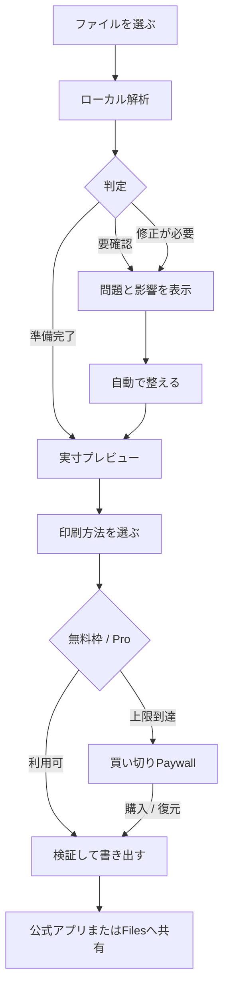

# プリント前｜コンビニ印刷PDFチェック

## Japan-first iOS product, engine, UI, monetization, and App Store specification

**Document date:** 2026-09-25  
**Market:** Japan  
**Platform:** iPhone and iPad, iOS/iPadOS 17+<br>
**Primary UI and App Store language:** Japanese  
**English in this document:** control translation for the developer/implementing AI  
**Product status:** `READY TO IMPLEMENT` for the locked launch scope  
**Listing status:** `DRAFT_READY`; final binary, StoreKit product, policies, screenshots, and native-language QA remain submission gates  

---

## 0. Instructions to the implementing AI

Treat this file as the canonical product contract.

1. Build the non-visual engine and automated tests before applying the production UI skin.
2. Do not add features marked `FUTURE` or `EXCLUDED`.
3. Do not claim that this app prints directly, controls a copier, guarantees the final physical print, or is affiliated with a convenience-store chain.
4. Do not use chain logos, chain color systems, competitor icons, competitor screenshots, or competitor names in the App Store name, subtitle, keyword field, or screenshot captions.
5. Process documents locally. Do not add accounts, ads, analytics SDKs, document uploads, a backend, location permission, or tracking.
6. Use the Japanese strings exactly as the customer-facing source meaning. English strings are implementation/control translations, not a license to replace the Japanese copy.
7. Load the price dynamically from StoreKit. Never hard-code `¥980` in customer-facing runtime copy.
8. Preserve active work across backgrounding, termination, and crashes. Competitor reviews specifically show that losing an unfinished layout is unacceptable.
9. The official printer app or Files share sheet is the final transport. Use public iOS sharing APIs; do not depend on undocumented third-party URL schemes.
10. If a UI request requires changing a rule in this specification, change the engine requirement and its tests first.

```yaml
canonical_contract:
  product_code: printmae
  app_name_ja: "プリント前｜コンビニ印刷PDFチェック"
  app_name_ja_character_count: 19
  internal_english_name: "PrintMae"
  bundle_identifier: "com.worksbien.printmae"
  core_promise_ja: "コンビニで印刷する前に、PDFの失敗原因を見つけて整える。"
  core_promise_en: "Find and repair likely PDF print problems before going to the convenience store."
  platform: iOS
  minimum_os: "17.0"
  device_family_launch: [iPhone, iPad]
  territories_launch: [Japan]
  ui_locale_launch: [ja]
  architecture: local_first
  account_required: false
  backend_required: false
  tracking: false
  ads: false
  document_upload: false
  monetization:
    free_final_exports_total: 3
    analysis_and_preview: unlimited
    launch_iap_type: non_consumable
    launch_target_price_jpy: 980
    subscription: false
  primary_category: Utilities
  secondary_category: Productivity
```

---

## 1. Product decision

### Build this

Build a preparation and compatibility layer between a customer’s file and the official convenience-store printing workflow.

**Official apps transport the file. プリント前 makes the file worth transporting.**

The shortest successful customer outcome is:

> 「変なPDFを読み込んだら、家を出る前に印刷できる状態か分かった。」  
> “I imported an awkward PDF and knew before leaving home whether it was ready to print.”

### Do not build this at launch

- A printer driver or direct copier connection.
- A replacement for official chain apps.
- A generic PDF editor.
- A photo-collage, fan-goods, sticker, or exact-centimetre craft-layout app.
- Resume creation, ID-photo creation, scanning/OCR, signatures, annotation, or document authoring.
- A nearby-store map or location search.
- Cloud storage, accounts, cross-device sync, collaboration, or document upload.
- An unsupported promise that every file will print perfectly.

The exclusions are deliberate. `ぴたプリ` already validates exact-size image layout with roughly 1,880 ratings, while `PDF余白調整` serves manual margin editing. The unclaimed wedge is an automatic, convenience-store-specific preflight that explains risk, repairs common failures, verifies the exported file, and hands it off honestly.

---

## 2. Evidence-to-product map

The App Store evidence validates the underlying job, not yet the exact willingness to pay for this preparation layer.

| Evidence observed on 2026-09-25 | What it proves | Product response |
|---|---|---|
| `かんたんnetprint` appeared first for `コンビニ印刷`, with about 140,000 ratings and 4.6 stars | Convenience-store printing has very large, sustained demand | Put `コンビニ印刷` in the name and make the first action file import |
| `PrintSmash` had 5,747 ratings and 2.5 stars | Users tolerate substantial friction because the underlying job matters | Diagnose before handoff; explain that the app does not control the copier |
| A PrintSmash review described a PDF transferring but never producing a print | “Transfer succeeded” is not the same as “file is safe to print” | Use a compatibility report and a post-export verification pass |
| `ファミマネットワークプリント` had 1,622 ratings and 2.2 stars; a review described installing the wrong app and wasting time | The official workflow is fragmented and confusing | Ask for the printing method, then provide one short handoff instruction |
| Official 7-Eleven guidance warns about margins, font replacement, mixed sizes, file constraints, and checking the print image | Layout and file compatibility failures are real, documented failure modes | Inspect page boxes, orientation, file size, page count, encryption, and mixed sizes; show physical preview |
| `PDF余白調整` reviews reported export failures after OS updates, unwanted lines, and lost outlines | A repair tool must treat export integrity as a core feature | Atomic export, reopen-and-verify, regression fixtures, and an explicit flattening warning |
| `ぴたプリ` reviews requested autosave, safe-area limits, crop/alignment, and reliable save behavior | Users value persistence and visible print boundaries | Autosave every change, provide undo, show non-printable/safe areas, never lose work on app switching |
| A generic printer app’s reviews complained about unclear recurring charges | Subscription friction damages trust in this utility category | No subscription, no trial-to-subscription conversion, one transparent lifetime unlock |

### Confidence

- **Demand for convenience-store printing:** high.
- **Demand for avoiding layout/file failures:** medium-high, supported by official warnings and reviews.
- **Demand for this exact cross-chain paid app:** provisional until launch conversion data exists.
- **Recommended response:** a narrow MVP, small free proof, and one low-friction lifetime purchase.

---

## 3. Target customer and moment of use

### Evidence-built customer profile — `SIMULATED`

| Field | Definition |
|---|---|
| Operator and purchaser | The same iPhone user |
| Typical users | Student, job seeker, parent, office worker, traveler, or anyone without a printer |
| Environment | Often rushed; file received by email, browser, LINE, AirDrop, or Files; may already be traveling to a store |
| Current workaround | Open one or more official apps, upload or transfer the file, inspect the copier screen, then discover a problem late |
| Failure cost | Wasted time, wasted print fee, missed application/deadline, repeat trip, or unreadable/cropped document |
| Purchase trigger | The app finds and fixes a visible risk in the user’s own document before the final export |
| Main objection | “Why pay when the official printing app is free?” |
| Product answer | The official app sends the file; this app checks, repairs, previews, and verifies it first |
| Accessibility needs | Dynamic Type, VoiceOver labels, large tap targets, no color-only status, plain Japanese |
| Unknown | Paid conversion at ¥980; which issue class creates the strongest purchase intent |

### Unfamiliar App Review profile

An Apple reviewer must understand within 20 seconds that the app:

1. imports a local PDF or image;
2. checks and repairs it locally;
3. creates a new print-ready PDF;
4. uses the standard iOS share sheet for the official printing app or Files;
5. works with the bundled sample and requires no account or physical copier.

---

## 4. Locked launch scope

### Inputs

| ID | Scope | Requirement | Status |
|---|---|---|---|
| REQ-IN-001 | LAUNCH | Import one PDF from Files, Open In, or the Share Extension | LOCKED |
| REQ-IN-002 | LAUNCH | Import one or more JPEG, PNG, or HEIC images and create one PDF | LOCKED |
| REQ-IN-003 | LAUNCH | Copy every imported security-scoped file into the app’s protected working directory before processing | LOCKED |
| REQ-IN-004 | LAUNCH | Reject unsupported formats with a precise message and retain the original file untouched | LOCKED |
| REQ-IN-005 | LAUNCH | Allow a password-protected PDF only after the user supplies the password; never persist or log the password | LOCKED |
| REQ-IN-006 | EXCLUDED | Direct Office, XPS, or proprietary document conversion | LOCKED |

### Preflight checks

| ID | Scope | Requirement | Status |
|---|---|---|---|
| REQ-CHECK-001 | LAUNCH | Detect unreadable, empty, corrupt, and password-protected PDFs | LOCKED |
| REQ-CHECK-002 | LAUNCH | Read page count, file size, media box, crop box, rotation, and page orientation for every page | LOCKED |
| REQ-CHECK-003 | LAUNCH | Detect mixed page sizes or orientations | LOCKED |
| REQ-CHECK-004 | LAUNCH | Compare output candidates against versioned convenience-print profiles | LOCKED |
| REQ-CHECK-005 | LAUNCH | Detect content intersecting the selected safe-print inset | LOCKED |
| REQ-CHECK-006 | LAUNCH | Detect image inputs whose effective resolution is below 150 dpi at the requested physical size | LOCKED |
| REQ-CHECK-007 | LAUNCH | Never claim arbitrary PDF image quality is sufficient when embedded-image DPI cannot be determined reliably | LOCKED |
| REQ-CHECK-008 | LAUNCH | Give every finding a severity, plain-Japanese explanation, affected pages, and one recovery action | LOCKED |

### Repairs

| ID | Scope | Requirement | Status |
|---|---|---|---|
| REQ-FIX-001 | LAUNCH | Normalize pages to A4 or B5 portrait/landscape without stretching content | LOCKED |
| REQ-FIX-002 | LAUNCH | Rotate pages by 90-degree increments | LOCKED |
| REQ-FIX-003 | LAUNCH | Fit content inside a user-visible safe area while preserving aspect ratio | LOCKED |
| REQ-FIX-004 | LAUNCH | Add white margins independently on each edge | LOCKED |
| REQ-FIX-005 | LAUNCH | Compress image-heavy output using deterministic quality steps until the selected profile limit is met or no safe step remains | LOCKED |
| REQ-FIX-006 | LAUNCH | Split a file when page-count or byte limits still fail | LOCKED |
| REQ-FIX-007 | LAUNCH | Merge imported images into one PDF in the order explicitly chosen by the user | LOCKED |
| REQ-FIX-008 | LAUNCH | Provide undo and redo for every reversible edit | LOCKED |
| REQ-FIX-009 | LAUNCH | Warn before a repair path flattens interactive PDF features; label the result `印刷用PDF` | LOCKED |
| REQ-FIX-010 | FUTURE | Manual crop, free-form canvas layout, stickers, text, signatures, or annotation | LOCKED |

### Output and handoff

| ID | Scope | Requirement | Status |
|---|---|---|---|
| REQ-OUT-001 | LAUNCH | Render a physical paper preview with page size, orientation, content boundary, and safe-print inset | LOCKED |
| REQ-OUT-002 | LAUNCH | Write output atomically to a temporary URL, reopen it, and verify page count, dimensions, readability, and profile constraints before exposing Share | LOCKED |
| REQ-OUT-003 | LAUNCH | Use the system share sheet to send the verified PDF to Files or an installed official printing app | LOCKED |
| REQ-OUT-004 | LAUNCH | Never show `完了` until the output file has passed verification | LOCKED |
| REQ-OUT-005 | LAUNCH | After handoff, tell the user to confirm the final preview and settings on the copier | LOCKED |
| REQ-OUT-006 | EXCLUDED | Undocumented URL schemes, automated upload to a chain, reservation-number generation, printer discovery, or copier control | LOCKED |

### Persistence and privacy

| ID | Scope | Requirement | Status |
|---|---|---|---|
| REQ-DATA-001 | LAUNCH | Autosave the active job after every meaningful change using a 300 ms debounce and atomic replacement | LOCKED |
| REQ-DATA-002 | LAUNCH | Restore the active job after background termination or crash | LOCKED |
| REQ-DATA-003 | LAUNCH | Store working files with complete file protection and exclude them from logs | LOCKED |
| REQ-DATA-004 | LAUNCH | Delete successful-job source and working files after 24 hours unless the user explicitly keeps the project | LOCKED |
| REQ-DATA-005 | LAUNCH | Keep user-created presets without keeping the source document | LOCKED |
| REQ-DATA-006 | LAUNCH | Provide `すべての書類を削除` in Settings with a confirmation naming exactly what will be deleted | LOCKED |
| REQ-DATA-007 | LAUNCH | No developer collection, document upload, account, tracking, advertising, or third-party analytics SDK | LOCKED |

---

## 5. Compatibility profiles

Rules must be data, not scattered `if` statements. Bundle signed, versioned JSON profiles and revise them with app updates after checking the official sources.

### Launch profiles reviewed 2026-09-25

| Profile ID | Customer label | Conservative launch constraints | Evidence status |
|---|---|---|---|
| `jp.seven.upload.v1` | `登録して印刷` / Upload then print | PDF output; maximum 10 MB; maximum 99 pages; no password protection; uniform target paper size; A4 or B5 launch targets | Official support evidence; use conservative limits |
| `jp.sharp.local.v1` | `店頭Wi‑Fiで送る` / Send over store Wi-Fi | PDF output; maximum 30 MB per file; maximum 200 pages; no password protection; split rather than exceed | Official PrintSmash evidence |
| `jp.generic.pdf.v1` | `あとで印刷方法を選ぶ` / Choose later | PDF; A4 or B5; no password; safe inset preview; 10 MB conservative target | Deliberately conservative fallback |

Do not display a green status solely because the profile passes. The user-visible copy is:

- `準備完了` — Ready for handoff.
- `要確認` — The file can be exported, but the named issue needs review.
- `修正が必要` — The chosen method is expected to reject or mishandle the file until repaired.

Always display this footer on the result and success screens:

> 店頭のコピー機で、最終プレビューと印刷設定を確認してください。  
> Check the final preview and print settings on the copier.

### Profile schema

```swift
import Foundation
import CoreGraphics

struct PrintProfile: Codable, Hashable, Sendable {
    let id: String
    let displayNameKey: String
    let reviewedAt: Date
    let sourceURLs: [URL]
    let acceptedOutputTypes: Set<String> // UTType identifiers
    let maxBytesPerFile: Int64
    let maxPagesPerFile: Int
    let allowedPaper: Set<PaperSpec>
    let allowsEncryptedPDF: Bool
    let requiresUniformPaperSize: Bool
    let safeInsetMillimetres: EdgeInsetsMM
}

enum PaperSpec: String, Codable, CaseIterable, Sendable {
    case a4Portrait, a4Landscape, b5Portrait, b5Landscape
}

struct EdgeInsetsMM: Codable, Hashable, Sendable {
    let top: Double
    let leading: Double
    let bottom: Double
    let trailing: Double
}
```

The profile loader must fail closed. If a bundled profile is missing, malformed, expired by the project’s review policy, or fails signature/hash validation, use `jp.generic.pdf.v1` and show `印刷方法の最新条件を確認してください` rather than inventing compatibility.

---

## 6. Primary process flow



### Normal path budget

| Measure | Budget |
|---|---:|
| Setup before first value | 0 screens |
| Taps from launch to analysis | 2: `ファイルを選ぶ` → file |
| Required typing | 0, unless the PDF is password-protected |
| Choices before first analysis | 0; use the conservative generic profile |
| Taps from report to share sheet | 3–4 |
| Explanatory reading on normal path | One headline, one status, at most three issue rows |

### First-launch behavior

Do not show a tutorial carousel. Open directly on the preparation screen with:

- primary action `ファイルを選ぶ`;
- secondary action `サンプルで試す`;
- a one-line privacy promise `書類はこの端末内で処理されます`;
- no paywall.

---

## 7. State machine

### Authoritative states

```swift
enum JobPhase: String, Codable, Sendable {
    case draft
    case importing
    case awaitingPassword
    case analysing
    case reportReady
    case repairing
    case previewReady
    case exportAuthorisation
    case exporting
    case exportVerified
    case sharing
    case completed
    case recoverableFailure
    case terminalFailure
}

enum ReadinessLevel: String, Codable, Sendable {
    case ready
    case review
    case blocked
}

struct PrintJobSnapshot: Codable, Sendable {
    let schemaVersion: Int
    let id: UUID
    var phase: JobPhase
    var source: SourceDescriptor?
    var selectedProfileID: String
    var targetPaper: PaperSpec
    var report: PreflightReport?
    var editRecipe: EditRecipe
    var export: ExportArtifact?
    var lastError: AppError?
    var createdAt: Date
    var updatedAt: Date
}
```

### Legal transitions

```yaml
transitions:
  draft: [importing]
  importing: [awaitingPassword, analysing, recoverableFailure, terminalFailure]
  awaitingPassword: [analysing, draft, terminalFailure]
  analysing: [reportReady, recoverableFailure, terminalFailure]
  reportReady: [repairing, previewReady, draft]
  repairing: [reportReady, previewReady, recoverableFailure]
  previewReady: [exportAuthorisation, repairing, draft]
  exportAuthorisation: [exporting, previewReady]
  exporting: [exportVerified, recoverableFailure]
  exportVerified: [sharing, completed]
  sharing: [completed, exportVerified]
  completed: [draft]
  recoverableFailure: [importing, analysing, repairing, exporting, draft]
  terminalFailure: [draft]
```

No other transition may be committed. A rejected transition must create a local diagnostic entry without mutating the job.

### Required interruption behavior

| Interruption | Required result |
|---|---|
| App backgrounds during analysis | Continue if permitted; otherwise persist input and restart analysis on foreground |
| App terminates during repair | Restore last committed recipe; never expose a partial output |
| App terminates during export | Delete incomplete temporary output; return to `previewReady` with `書き出しをやり直してください` |
| Storage fills during export | Keep source and recipe; show required free-space estimate and retry action |
| User cancels share sheet | Keep verified output and return to `exportVerified`; do not consume another free export |
| Purchase cancelled | Return to preview with work intact |
| Purchase pending | Keep preview and show `購入の承認を待っています` |
| Purchase revoked/refunded | Future exports return to the free boundary; existing user files remain available |

---

## 8. Screen inventory and states

Use a three-destination shell only: `準備` (Prepare), `履歴` (History), `設定` (Settings). Keep the primary workflow inside a single `NavigationStack` under `準備`.

### S01 — 準備 / Prepare home

**Purpose:** start in one tap and recover unfinished work.

**Japanese UI**

- Navigation title: `印刷の準備`
- Hero title: `コンビニで刷る前に確認`
- Supporting text: `PDFの余白・向き・サイズ・容量を確認して整えます。`
- Primary button: `ファイルを選ぶ`
- Secondary link: `サンプルで試す`
- Privacy line: `書類はこのiPhone内で処理されます`
- Free-state line: `無料書き出し：残り3回` (dynamic)
- Draft card, when present: `作業を続ける`

**English control translation**

- `Prepare to Print`
- `Check before convenience-store printing`
- `Check and repair PDF margins, orientation, size, and file capacity.`
- `Choose File`
- `Try a Sample`
- `Documents are processed on this iPhone.`

**States**

- Empty: import and sample actions.
- Draft available: one prominent recovery card above import.
- Free quota exhausted: keep import and analysis available; show `書き出しにはProが必要です` without opening a paywall.
- File importer cancelled: no toast and no state change.

### S02 — 読み込み中 / Importing

- Title: `ファイルを読み込んでいます`
- Show file name, byte size, and cancel button.
- Never use an indeterminate spinner for longer than two seconds without a second line describing the current stage.
- If copying a large file, show deterministic byte progress.

### S03 — パスワード / Password unlock

- Title: `このPDFは保護されています`
- Body: `印刷用PDFを作るため、ファイルのパスワードを入力してください。パスワードは保存されません。`
- Secure field label: `PDFのパスワード`
- Primary: `開く`
- Secondary: `キャンセル`
- Wrong password: inline `パスワードが違います。もう一度確認してください。`
- After five failed attempts, do not lock the user out; preserve the source and allow cancel.

### S04 — 解析中 / Analysing

Stage text must move through real engine stages:

1. `ページを確認しています`
2. `余白と向きを確認しています`
3. `印刷方法の条件と照合しています`

Do not fabricate percentage completion. Show percentage only when total pages are known and page analysis is measurable.

### S05 — 印刷前チェック / Preflight report

**Header states**

| State | Japanese headline | Icon | Color role |
|---|---|---|---|
| Ready | `準備完了` | `checkmark.circle.fill` | Success green |
| Review | `2点を確認してください` | `exclamationmark.triangle.fill` | Warning amber |
| Blocked | `このままでは書き出せません` | `xmark.octagon.fill` | Error red |

Color is supplemental. Always include the icon, headline, and plain-language status.

**Summary rows**

- `A4・縦`
- `12ページ`
- `12.8 MB`
- chosen profile label

**Issue-row anatomy**

1. Severity icon.
2. Concrete issue: `1ページが横向きです`.
3. Consequence: `A4縦で印刷すると文字が小さくなります`.
4. Affected pages: `3ページ目`.
5. Action: `自動で整える` or `詳しく見る`.

**Primary actions**

- When fixable: `まとめて自動で整える`.
- When ready: `実寸プレビューを見る`.
- Secondary: `自分で調整`.

### S06 — 自動修正の確認 / Fix plan

Show an explicit before/after recipe before applying it.

Example:

```text
適用する修正
✓ 3ページ目を右に90°回転
✓ 全ページをA4縦に統一
✓ 上下左右に5 mmの余白
✓ 12.8 MBから10 MB以下を目標に圧縮
```

Buttons:

- Primary: `この内容で整える`
- Secondary: `項目を変更`
- Destructive-looking actions are prohibited; the original is never overwritten.

### S07 — 実寸プレビュー / Physical preview

**Layout**

- Full-width paper canvas on a neutral `systemGroupedBackground`.
- White paper with a 1 px separator, not a heavy shadow.
- Toggle: `仕上がり` / `元のファイル`.
- Overlay toggle: `印刷の安全範囲`.
- Page scrubber with `3 / 12`.
- Zoom and pan use native gestures.
- Bottom summary: `A4・縦｜9.4 MB｜12ページ`.
- Primary: `印刷用PDFを書き出す`.

**Fine adjustments**

- `用紙`: A4 / B5.
- `向き`: 自動 / 縦 / 横.
- `合わせ方`: 収める / 原寸.
- `余白`: 自動 / 3 mm / 5 mm / 10 mm / カスタム.
- If there are five or fewer choices, show all as segmented controls or radio rows; do not hide them in a long picker.

**Flattening notice**

If needed:

> レイアウトを安定させるため、リンクやしおりなどの画面用機能を除いた印刷用PDFを作成します。元のPDFは変更されません。

### S08 — 印刷方法 / Print method

Ask only at export time, because the generic conservative profile already produced the first preview.

- Title: `どの方法で印刷しますか？`
- Option A: `登録して印刷` — `先にファイルを登録し、店頭で呼び出す方法`
- Option B: `店頭Wi‑Fiで送る` — `コピー機のWi‑Fiに接続して、その場で送る方法`
- Option C: `あとで選ぶ` — `10 MB以下の汎用PDFとして保存`

After selection, rerun only the profile-dependent checks. If the chosen method changes readiness, return to S05 with the new issue highlighted.

Do not request location. Do not recommend the “nearest” chain. Do not display chain logos.

### S09 — Paywall

The paywall appears **only** when the user taps `印刷用PDFを書き出す` after all three free exports have been used.

**Never show it:** at launch, before import, during analysis, before the user sees their own preview, or after a failed export.

**Japanese copy**

- Eyebrow: `書き出しの準備ができました`
- Headline: `プリント前 Proを買い切りで利用`
- Benefit 1: `印刷用PDFを何度でも書き出し`
- Benefit 2: `自動調整・圧縮・分割を制限なく利用`
- Benefit 3: `広告なし・サブスクリプションなし`
- Purchase button: `買い切りでProにする — {StoreKit displayPrice}`
- Restore: `購入を復元`
- Dismiss: `今はしない`
- Disclosure: `お支払いはApple IDに請求されます。`

Do not use a countdown, fake discount, preselected subscription, trial, crossed-out price, or close-button delay.

### S10 — 書き出し / Exporting and verification

Real stages:

1. `印刷用PDFを作成しています`
2. `書き出したPDFを確認しています`
3. `共有の準備をしています`

The free-export counter is decremented only after `exportVerified`. Retrying the same failed job never consumes another free export.

### S11 — 準備完了 / Verified result

- Headline: `印刷用PDFの準備ができました`
- Proof rows: `9.4 MB`, `12ページ`, `A4・縦`, `パスワードなし`.
- Primary: `公式アプリまたはFilesへ共有`
- Secondary: `ファイルに保存`
- Instruction: `共有先で印刷アプリを選び、店頭の最終プレビューを確認してください。`
- Never say `印刷が完了しました`.

### S12 — 履歴 / History

Default to metadata-only rows:

- file display name;
- date;
- target paper;
- status;
- whether a kept project still has local files.

Actions: `もう一度開く`, `同じ設定を使う`, `削除`.

If the project was not kept, `同じ設定を使う` opens the file picker with the preset loaded; it must not imply that the old document still exists.

### S13 — 設定 / Settings

Only include:

- `既定の用紙`: A4 (default) / B5.
- `既定の印刷方法`: あとで選ぶ (default), 登録して印刷, 店頭Wi‑Fiで送る.
- `作業ファイルの自動削除`: 24時間後 (default), 書き出し後すぐ, 7日後.
- `購入を復元`.
- `すべての書類を削除`.
- `プライバシー`.
- `使い方・お問い合わせ`.
- `印刷条件の確認日`.
- app version.

Do not put paper orientation, margin, or compression preferences in Settings; those belong in the job.

### Required error states

| Error code | Japanese message | Recovery |
|---|---|---|
| `unsupportedType` | `この形式は読み込めません。PDF、JPEG、PNG、HEICを選んでください。` | Choose another file |
| `corruptPDF` | `PDFを開けませんでした。元のアプリからもう一度保存してください。` | Reimport |
| `emptyPDF` | `このPDFには印刷できるページがありません。` | Choose another file |
| `wrongPassword` | `パスワードが違います。もう一度確認してください。` | Retry or cancel |
| `profileTooLarge` | `選んだ方法ではファイルが大きすぎます。圧縮または分割できます。` | Auto-fix |
| `profileTooManyPages` | `選んだ方法のページ上限を超えています。分割して書き出せます。` | Split |
| `mixedPaper` | `ページサイズが混在しています。A4またはB5に統一してください。` | Normalize |
| `lowStorage` | `書き出しに必要な空き容量が足りません。あと{size}空けてください。` | Manage storage, retry |
| `exportValidationFailed` | `書き出したPDFを確認できませんでした。元のファイルは変更されていません。` | Retry with safe render |
| `purchaseUnavailable` | `購入情報を取得できません。通信を確認してもう一度お試しください。` | Retry; keep work |
| `purchasePending` | `購入の承認を待っています。承認後に書き出せます。` | Dismiss and return later |
| `shareCancelled` | No error copy | Return to verified result |

---

## 9. UI direction for a Japanese utility

This is a design inference from the reviewed Japanese utility listings and official Japanese accessibility guidance, not a claim that every Japanese user shares one taste.

### Visual language

- Native SwiftUI, system navigation, system sheets, system share sheet, and SF Symbols.
- Japanese system font; no decorative Latin-first font.
- White paper surfaces on `systemGroupedBackground`.
- One restrained indigo/blue accent for primary actions.
- Green, amber, and red are reserved for semantic readiness states.
- Information-dense but calm: small number of cards, clear separators, explicit labels, and minimal ornamental whitespace.
- No gradients, mascots, confetti, glass-heavy effects, oversized lifestyle illustrations, or chain-inspired colors.
- Avoid icon-only controls for consequential actions. Japanese labels remain visible.

### Type and spacing

```yaml
typography:
  navigation_title: system_title2_semibold
  screen_headline: system_title2_bold
  section_heading: system_headline
  body: system_body
  supporting: system_subheadline
  metadata: system_footnote
  dynamic_type: required
layout:
  horizontal_margin_phone: 16pt
  section_gap: 20pt
  row_vertical_padding: 12pt
  minimum_tap_target: 44pt
  card_radius: 12pt
  status_icon_size: 22pt
```

Do not encode fixed point sizes into domain components. Use semantic text styles and test Japanese at AX5 accessibility size.

### Error and form behavior

- Put the error immediately below the affected row or field.
- State the limit before the user violates it.
- Never rely on a disabled primary button to teach the requirement; let the tap reveal a precise inline correction.
- Normalize harmless input automatically, such as full-width numeric password characters to ASCII digits where semantically safe.
- Do not interrupt VoiceOver with continuously announced validation; move focus to the summary after explicit submission.

### App icon direction

Use a distinctive, unbranded symbol:

- white paper sheet;
- visible margin frame;
- small verification check at the lower-right;
- indigo background;
- no store logos, printer brand, QR code, or tiny Japanese text.

The icon must read as “document check” at 60 px and must not resemble an official convenience-store app.

---

## 10. Engine architecture

### Module boundary

```text
PrintMaeApp/
  AppShell/                 # Existing shell integration only
  Features/
    Prepare/
    PreflightReport/
    PhysicalPreview/
    Export/
    History/
    Settings/
    Paywall/
  Engine/
    Domain/
    Import/
    Analysis/
    Repair/
    Rendering/
    Verification/
    Profiles/
    Entitlements/
    Persistence/
  Extensions/
    ShareExtension/
  Resources/
    Localizable.xcstrings
    PrintProfiles/
    Sample/
  Tests/
    Unit/
    Integration/
    Property/
    Fixtures/
    UI/
```

The `Engine` target must not import SwiftUI, StoreKit UI, or the app shell. StoreKit transaction handling may sit behind an engine protocol.

### Domain contracts

```swift
import Foundation

enum IssueSeverity: Int, Codable, Comparable, Sendable {
    case information = 0
    case review = 1
    case blocking = 2

    static func < (lhs: Self, rhs: Self) -> Bool { lhs.rawValue < rhs.rawValue }
}

enum IssueCode: String, Codable, Sendable {
    case encrypted
    case corrupt
    case empty
    case pageLimitExceeded
    case byteLimitExceeded
    case mixedPaperSizes
    case mixedOrientations
    case contentOutsideSafeArea
    case lowImageResolution
    case flatteningRequired
    case profileNeedsReview
}

struct PageRange: Codable, Hashable, Sendable {
    let indexes: IndexSet // zero-based internally
}

struct PreflightIssue: Identifiable, Codable, Hashable, Sendable {
    let id: UUID
    let code: IssueCode
    let severity: IssueSeverity
    let pages: PageRange?
    let titleKey: String
    let consequenceKey: String
    let suggestedFix: FixAction?
}

struct PreflightReport: Codable, Sendable {
    let profileID: String
    let readiness: ReadinessLevel
    let pageCount: Int
    let inputBytes: Int64
    let pages: [PageAnalysis]
    let issues: [PreflightIssue]
    let analysedAt: Date
}

enum FixAction: Codable, Hashable, Sendable {
    case unlock
    case rotate(pageIndexes: IndexSet, quarterTurnsClockwise: Int)
    case normalizePaper(PaperSpec)
    case fitInsideSafeArea(EdgeInsetsMM)
    case addMargins(EdgeInsetsMM)
    case compress(CompressionPolicy)
    case split(maxPages: Int, maxBytes: Int64)
    case flattenForPrint
}

struct EditRecipe: Codable, Hashable, Sendable {
    var actions: [FixAction]
    var revision: Int
}
```

### Service protocols

```swift
protocol DocumentImporter: Sendable {
    func stage(_ sourceURL: URL) async throws -> StagedDocument
}

protocol PreflightAnalysing: Sendable {
    func analyse(
        document: StagedDocument,
        profile: PrintProfile,
        target: PaperSpec
    ) async throws -> PreflightReport
}

protocol PrintRepairing: Sendable {
    func render(
        document: StagedDocument,
        recipe: EditRecipe,
        destination: URL
    ) async throws -> RenderManifest
}

protocol OutputVerifying: Sendable {
    func verify(
        output: URL,
        expected: RenderManifest,
        profile: PrintProfile
    ) async throws -> VerificationReport
}

protocol EntitlementProviding: Sendable {
    func snapshot() async -> EntitlementSnapshot
    func purchaseLifetime() async throws -> EntitlementSnapshot
    func restore() async throws -> EntitlementSnapshot
    func authoriseExport(jobID: UUID) async throws -> ExportAuthorisation
    func commitVerifiedExport(_ authorisation: ExportAuthorisation) async throws
}
```

### Orchestration

```swift
actor PrintPreparationEngine {
    private let importer: DocumentImporter
    private let analyser: PreflightAnalysing
    private let repairer: PrintRepairing
    private let verifier: OutputVerifying
    private let jobs: JobRepository
    private let entitlements: EntitlementProviding

    func importAndAnalyse(
        sourceURL: URL,
        profile: PrintProfile,
        target: PaperSpec
    ) async throws -> PrintJobSnapshot {
        var job = PrintJobSnapshot.new(profileID: profile.id, targetPaper: target)
        job.phase = .importing
        try await jobs.save(job)

        let staged = try await importer.stage(sourceURL)
        job.source = staged.descriptor
        job.phase = .analysing
        try await jobs.save(job)

        let report = try await analyser.analyse(
            document: staged,
            profile: profile,
            target: target
        )
        job.report = report
        job.phase = .reportReady
        try await jobs.save(job)
        return job
    }

    func verifiedExport(
        jobID: UUID,
        destinationDirectory: URL,
        profile: PrintProfile
    ) async throws -> ExportArtifact {
        var job = try await jobs.require(jobID)
        guard job.phase == .previewReady else { throw AppError.illegalTransition }

        let authorisation = try await entitlements.authoriseExport(jobID: jobID)
        job.phase = .exporting
        try await jobs.save(job)

        let temporary = destinationDirectory
            .appendingPathComponent(".\(job.id.uuidString).partial.pdf")
        let final = destinationDirectory
            .appendingPathComponent("print_ready_\(job.id.uuidString.prefix(8)).pdf")

        do {
            let manifest = try await repairer.render(
                document: try await jobs.stagedDocument(for: jobID),
                recipe: job.editRecipe,
                destination: temporary
            )
            let proof = try await verifier.verify(
                output: temporary,
                expected: manifest,
                profile: profile
            )
            try AtomicFileMover.replaceItem(at: final, with: temporary)
            let artifact = ExportArtifact(url: final, verification: proof)
            job.export = artifact
            job.phase = .exportVerified
            try await jobs.save(job)
            try await entitlements.commitVerifiedExport(authorisation)
            return artifact
        } catch {
            try? FileManager.default.removeItem(at: temporary)
            job.phase = .recoverableFailure
            job.lastError = AppError.map(error)
            try await jobs.save(job)
            throw error
        }
    }
}
```

The implementation must ensure that `commitVerifiedExport` is idempotent by authorisation ID. App termination after file verification but before counter persistence must not double-charge a free export on retry.

### Rendering rules

1. Convert millimetres to PDF points with `points = millimetres / 25.4 * 72`.
2. Never stretch. Compute one uniform scale factor.
3. Centre fitted content inside the target safe rectangle unless the user explicitly changes alignment.
4. Respect page rotation before calculating the bounding box.
5. Render to a new file; never modify the imported source.
6. Use vector-preserving Quartz/PDF drawing when it produces a valid page. Use raster flattening only as the explicit safe fallback.
7. For image inputs, preserve color space where supported and cap downsampling according to the selected compression policy.
8. Split only on page boundaries. Name parts `_part_01_of_03.pdf`.
9. Reopen every output with both `CGPDFDocument` and `PDFDocument` before success.

### Safe-fit calculation

```swift
func aspectFitScale(source: CGSize, destination: CGRect) throws -> CGFloat {
    guard source.width > 0, source.height > 0,
          destination.width > 0, destination.height > 0 else {
        throw AppError.invalidGeometry
    }
    return min(destination.width / source.width,
               destination.height / source.height)
}

func centredAspectFitRect(source: CGSize, destination: CGRect) throws -> CGRect {
    let scale = try aspectFitScale(source: source, destination: destination)
    let fitted = CGSize(width: source.width * scale, height: source.height * scale)
    return CGRect(
        x: destination.midX - fitted.width / 2,
        y: destination.midY - fitted.height / 2,
        width: fitted.width,
        height: fitted.height
    ).integral
}
```

### Export verification

`VerificationReport.pass` requires all of the following:

- the final file exists and has non-zero length;
- both PDF parsers open it;
- actual page count equals the render manifest;
- every page box is finite, positive, and matches the target within 0.5 PDF points;
- file bytes and pages meet the selected profile;
- the output is not encrypted;
- sampled page renders are non-empty;
- first, last, and every tenth page render without exception;
- temporary and final paths are not the imported source path.

If verification fails, the UI must never expose the output share action.

---

## 11. Monetization contract

### Recommendation

**Freemium proof + one lifetime non-consumable purchase.**

- Analysis: free and unlimited.
- Repairs and preview: free and unlimited.
- First three verified final exports: free per device ledger. Persist the count in Keychain so reinstalling the app on the same device does not normally reset it; do not claim cross-device enforcement without a backend.
- Pro: unlimited verified exports and all launch repair tools.
- Recommended Japan launch target: **¥980 lifetime**.
- No subscription, ads, timed trial, or recurring charge.

### Why this model

- The customer’s use is episodic, so a recurring subscription lacks continuing value.
- A free official transport app makes a paid-before-value wall difficult to justify.
- Unlimited free previews prove the app found a real issue in the user’s own file.
- Three exports are enough to validate utility without allowing indefinite use.
- Reviews of a generic printer app show strong hostility to unclear recurring charges.
- One product keeps StoreKit, copy, testing, and customer choice simple.

### StoreKit configuration

```yaml
storekit:
  app_bundle_id: "com.worksbien.printmae"
  product_id: "com.worksbien.printmae.pro.lifetime"
  type: non_consumable
  reference_name: "PrintMae Pro Lifetime"
  display_name_ja: "プリント前 Pro（買い切り）"
  description_ja: "印刷用PDFの書き出し、自動調整、圧縮、分割を回数制限なく利用できます。"
  family_sharing: recommended_if_supported
  launch_target_price_jpy: 980
```

The runtime button must use `Product.displayPrice`. The Japanese App Store description must say `買い切り` but omit the fixed numeric price.

### Entitlement states to test

- unknown/offline snapshot;
- free with 3, 2, 1, and 0 exports remaining;
- purchased verified;
- purchase pending;
- purchase cancelled;
- purchase failed;
- restored;
- refunded/revoked;
- StoreKit product temporarily unavailable;
- reinstall and `AppStore.sync()` recovery.

### Post-launch price decision

Do not add a cheaper pass at launch. Review after at least 300 paywall views:

- If users repeatedly reach the paywall after a successful repair but lifetime conversion is weak, test a second option only then.
- Candidate experiment: a clearly non-renewing short-use product, not an auto-renewing subscription.
- Do not lower the lifetime price from one anecdote; inspect paywall view-to-purchase, refund, and review language together.

---

## 12. Localization contract

### Launch behavior

- Ship Japanese UI first.
- Keep every string in a String Catalog with an English developer translation and developer comment.
- Do not expose English UI at launch unless every screen, error, accessibility label, paywall, and sample file has passed English QA.
- Use Japanese punctuation and natural task language; do not translate `preflight` literally in customer copy. Use `印刷前チェック`.

### Core string keys

```json
{
  "prepare.title": {"ja": "印刷の準備", "en": "Prepare to Print"},
  "prepare.choose_file": {"ja": "ファイルを選ぶ", "en": "Choose File"},
  "prepare.try_sample": {"ja": "サンプルで試す", "en": "Try a Sample"},
  "privacy.local_processing": {"ja": "書類はこのiPhone内で処理されます", "en": "Documents are processed on this iPhone."},
  "report.ready": {"ja": "準備完了", "en": "Ready for handoff"},
  "report.review": {"ja": "%lld点を確認してください", "en": "Review %lld items"},
  "report.blocked": {"ja": "このままでは書き出せません", "en": "Repair required before export"},
  "repair.auto": {"ja": "まとめて自動で整える", "en": "Fix Automatically"},
  "preview.physical": {"ja": "実寸プレビュー", "en": "Physical Preview"},
  "export.create": {"ja": "印刷用PDFを書き出す", "en": "Export Print PDF"},
  "export.share": {"ja": "公式アプリまたはFilesへ共有", "en": "Share to an official app or Files"},
  "purchase.lifetime": {"ja": "買い切りでProにする — %@", "en": "Unlock Pro for life — %@"},
  "purchase.restore": {"ja": "購入を復元", "en": "Restore Purchase"},
  "copier.final_check": {"ja": "店頭のコピー機で、最終プレビューと印刷設定を確認してください。", "en": "Check the final preview and print settings on the copier."}
}
```

Developer comments must define placeholders and context. Never concatenate Japanese grammar from fragments.

---

## 13. App Store name and organic positioning

### Final Japanese name

**`プリント前｜コンビニ印刷PDFチェック`** — 19 characters.

Why it wins:

- `プリント前` gives the app a memorable, ownable lead phrase.
- `コンビニ印刷` matches the highest-intent observed store query.
- `PDFチェック` immediately differentiates it from official transport apps and photo editors.
- It does not use a chain name, competitor name, price, unsupported superlative, or affiliation claim.
- No exact App Store or open-web collision was found in the 2026-09-25 check.

**Naming status:** positioning `LOCKED`; formal trademark clearance remains a release/legal check and no automated search can provide a 100% legal guarantee.

### Subtitle

**`余白・向き・サイズを自動で整える`** — 16 characters.

It adds the repair benefit without repeating `コンビニ印刷`, `PDF`, or `チェック`.

### Rejected alternatives

| Candidate | Reason rejected |
|---|---|
| `コンビニ印刷・PDF調整` | Strong search match but too generic and less distinctive under Apple’s naming guidance |
| `コンビニ印刷チェッカー` | Clear but does not communicate PDF focus or repair value |
| `PrintReady JP` | Weak Japanese search pull and requires explanation |
| `コンビニプリントPro` | `Pro` implies paid positioning before value and does not explain the task |
| `セブン・ローソンPDF印刷` | Trademark stuffing, incomplete coverage, and affiliation risk |

### English reference localization

- Name: `PrintMae: PDF Print Prep` — 24 characters.
- Subtitle: `Check margins, size and layout` — 30 characters.
- This is a future/secondary localization, not the Japan launch positioning.

### Keyword field — Japanese

**89 UTF-8 bytes:**

```text
余白設定,用紙サイズ,向き変更,履歴書,写真プリント,ファイル圧縮
```

Do not add terms already present in the name or subtitle. Do not add chain names, competitor names, or `無料`.

### Keyword field — English reference

**87 bytes:**

```text
margin,page size,orientation,resume,document,photo,compress,merge,split,offline,preview
```

### Categories

- Primary: **Utilities** — the app solves a concrete file-preparation job and the validated printing apps cluster here.
- Secondary: **Productivity** — the output is a work/document workflow.

---

## 14. App Store listing copy — Japanese

### Name

`プリント前｜コンビニ印刷PDFチェック`

### Subtitle

`余白・向き・サイズを自動で整える`

### Promotional text

Omit at launch. It does not affect search ranking and creates stale-copy work without a genuine timely message.

### Description

```text
コンビニでPDFを印刷する前に、余白・向き・用紙サイズ・ファイル容量を確認し、印刷しやすいPDFに整えるアプリです。

プリント前は、プリンターへ直接送るアプリではありません。書類をこの端末内で確認・調整し、完成した印刷用PDFを印刷アプリへ共有するか、「ファイル」に保存します。

■ 印刷前に確認
・ページの向きと用紙サイズ
・余白と印刷の安全範囲
・ページ数とファイル容量
・パスワード保護や読み込みエラー
・印刷方法ごとの主なファイル条件

■ 自動で整える
・A4またはB5へ比率を保って調整
・ページの回転
・白い余白の追加
・画像中心のPDFを圧縮
・上限を超えるPDFを分割
・写真を印刷用PDFに変換

■ 印刷前に見える
実際の用紙に近いプレビューで、文字や画像が端に寄りすぎていないか確認できます。元のファイルと仕上がりを切り替えて比較できます。

■ 安心して書き出し
作成したPDFをもう一度開いて、ページ数・用紙サイズ・容量を確認してから共有します。元のファイルは変更しません。

■ プライバシー
書類は端末内で処理されます。アカウント登録、広告、追跡はありません。本アプリは処理のために書類をアップロードしません。共有時の宛先は利用者がiOSで選びます。

分析とプレビューは無料です。最初の3回は印刷用PDFを書き出して試せます。その後は、買い切りのプリント前 Proで回数制限なく書き出せます。購入価格はアプリ内に表示されるApp Storeの価格をご確認ください。

ご注意：本アプリはコンビニ各社やプリンターメーカーの公式アプリではありません。実際に印刷する前に、店頭のコピー機で最終プレビューと印刷設定を確認してください。
```

### English control translation of the opening

```text
Before printing a PDF at a convenience store, check its margins, orientation, paper size, and file capacity, then create a PDF that is easier to print.

PrintMae does not send files directly to a printer. It checks and repairs documents on device, then lets the user choose a printing app or Files through iOS sharing.
```

### Live support and policy URLs

- Support: `https://worksbienstudios.com/customerservice`
- Marketing: `https://lrodeveloperr.github.io/Printmae-ios/`
- Privacy: `https://lrodeveloperr.github.io/Printmae-ios/privacy/`

These are saved in App Store Connect. Recheck the signed binary and live policy before App Review.

---

## 15. Screenshot plan

Capture authentic final UI on iPhone and iPad after a native build. Use fictional documents that genuinely trigger any shown findings. The built-in two-page A4 sample is clean and must not be depicted with warnings. Verify Apple's accepted sizes at upload.

Suggested Japanese captions for the first three iPhone images:

1. `コンビニで印刷する前に、PDFの問題を確認`
2. `余白・向き・サイズをまとめて整える`
3. `書き出し後も確認して、印刷アプリへ共有`

Show actual analysis, paper preview, and verified export states; do not invent proof rows or values. Avoid chain branding and other media without rights.

---

## 16. App Store compliance and review pack

### Policy fit

| Area | Draft decision |
|---|---|
| Accurate metadata | Description explicitly says the app prepares files and does not print directly |
| In-app purchase clarity | Description discloses three free exports and the lifetime paid boundary; paywall uses StoreKit price |
| Screenshot authenticity | Only final in-app UI; no splash/login-only frames |
| Copycat risk | Distinct name, UI, and preparation job; no copied icon, branding, or official-app presentation |
| Trademarks | No chain marks in ranked metadata or screenshot captions; factual in-app references, if added, must be text-only and reviewed |
| Privacy | Data Not Collected only if the final binary contains no analytics/ads/upload SDKs and policies match |
| Accounts | None |
| Permissions | No location, camera, contacts, or full photo-library permission. Use Files, Share Extension, and PhotosPicker |
| IAP | One non-consumable product through StoreKit 2; Restore Purchase available |
| Age rating | Complete Apple’s current questionnaire truthfully; expected low rating if no other shell content changes the result |
| Encryption/export | Use Apple system cryptography/file protection only; confirm the final Xcode export-compliance answer |
| Content rights | Bundled sample and marketing documents must be original or licensed |

### Saved App Review notes — Japanese

```text
アカウント登録や専用ハードウェアは不要です。iPhoneとiPadに対応しています。

確認手順：
1. 「サンプルで試す」を選択し、PDFの分析結果を確認します。
2. 「用紙プレビューを見る」で用紙と安全範囲を確認します。
3. 「印刷用PDFを書き出す」から印刷方法を選び、書き出します。最初の3回は無料です。
4. iOSの共有シートで印刷アプリへの共有または「ファイル」に保存できます。

書類は端末内で処理されます。広告、追跡、解析SDK、位置情報の利用はありません。本アプリは処理のために書類をアップロードしません。共有先は利用者がiOSで選びます。4回目以降の書き出しで買い切りのプリント前 Proが案内されます。
```

### App Store Connect draft answers

```yaml
primary_language: Japanese
availability: Japan
primary_category: Utilities
secondary_category: Productivity
made_for_kids: false
sign_in_required: false
hardware_required: false
ads: false
tracking: false
data_collection_expected: none
iap_present: true
iap_type: non_consumable
subscription_present: false
content_rights: no_third_party_app_supplied_content
uses_only_standard_apple_encryption: true
```

Age rating 4+ and Content Rights No are saved in App Store Connect; Data Not Collected remains drafted but unpublished. Recheck against the signed archive, privacy manifest, SDK inventory, shell, policies, and live App Store Connect record before release.

---

## 17. Test and release gate

### Minimum fixtures

1. One-page A4 portrait PDF.
2. A4 document with one 90° rotated page.
3. Mixed A4/B5 page sizes.
4. Content touching each edge.
5. Password-protected PDF with correct and incorrect passwords.
6. Corrupt/truncated PDF.
7. Zero-page PDF.
8. 99-, 100-, 200-, and 201-page PDFs.
9. 9.9 MB, 10.0 MB, 10.1 MB, 29.9 MB, 30.0 MB, and 30.1 MB PDFs.
10. HEIC/JPEG/PNG at 72, 149, 150, and 300 effective dpi.
11. PDF with outline/bookmarks, links, annotations, and forms to exercise the flattening warning.
12. Japanese filenames, decomposed Unicode, emoji, very long names, and path separators.
13. Low-storage and interrupted-export simulations.
14. Legacy job schema for every migration version.

### Acceptance tests

| Test ID | Requirements | Oracle |
|---|---|---|
| T-IMPORT-001 | REQ-IN-001/003 | Imported source is copied, protected, readable, and original hash unchanged |
| T-IMPORT-002 | REQ-IN-005 | Correct password opens; wrong password does not mutate or persist secrets |
| T-CHECK-001 | REQ-CHECK-002/003 | Every page box and rotation matches fixture truth |
| T-CHECK-002 | REQ-CHECK-004 | Boundary bytes/pages produce the correct profile severity |
| T-FIX-001 | REQ-FIX-001/003 | 10,000 generated source/target rectangles preserve aspect ratio and remain inside destination |
| T-FIX-002 | REQ-FIX-002 | Four quarter-turns return to original geometry |
| T-FIX-003 | REQ-FIX-005/006 | Compression never exceeds policy floor; split output covers every page exactly once |
| T-STATE-001 | REQ-DATA-001/002 | Termination at every legal phase restores to the declared recovery state |
| T-OUT-001 | REQ-OUT-002/004 | Corrupt or dimension-mismatched output cannot enter `exportVerified` |
| T-ENT-001 | Monetization | Only a verified new export consumes one free authorisation |
| T-ENT-002 | Monetization | Cancelled share, failed export, and same-export retry do not decrement again |
| T-PRIV-001 | REQ-DATA-003/007 | No file names, page text, passwords, or image bytes appear in logs/network traces |
| T-LOC-001 | Localization | Every customer string and accessibility label has Japanese content and valid placeholders |
| T-UI-001 | S01–S11 | Sample file completes the full path on iPhone SE 2nd gen, current 6.9-inch simulator, and iPad portrait/landscape |

### Quality thresholds

- Swift compiler warnings: zero.
- Critical state transitions: positive, negative, boundary, retry, and interruption tests.
- Geometry/property sequences: minimum 10,000 deterministic cases.
- PDF/import parser fuzzing: minimum 30 minutes per parser per candidate build.
- Critical engine mutation score: minimum 80%, or a documented equivalent control when the Swift tool cannot instrument the module.
- Known critical/high dependency or security findings: zero.
- Zero unresolved critical/high failures in export, persistence, entitlements, or privacy.
- VoiceOver, Dynamic Type, Reduce Motion, dark mode, and increased contrast checked on the final UI.

### Rating prompt

Request a rating only after the third successful `completed` job and only when:

- no error occurred in that job;
- the user did not just dismiss the paywall;
- at least seven days have passed since installation;
- the app has not asked in the previous 120 days.

Never ask after a failed or cancelled workflow.

---

## 18. Build sequence for the AI

```yaml
implementation_order:
  - id: 1
    deliverable: Domain models, state reducer, profile schema, fixtures
    gate: All transition and profile tests pass
  - id: 2
    deliverable: Security-scoped import, staging, file protection, atomic job repository
    gate: Import, interruption, migration, and privacy tests pass
  - id: 3
    deliverable: PDF/image analysis and issue engine
    gate: Fixture truth and boundary tests pass
  - id: 4
    deliverable: Repair renderer, compression, split, and output verifier
    gate: Reopen-and-verify, property, fuzz, and low-storage tests pass
  - id: 5
    deliverable: StoreKit 2 entitlement adapter and free-export ledger
    gate: Purchase, restore, pending, refund, offline, and idempotency tests pass
  - id: 6
    deliverable: Plain diagnostic harness with sample and every error state
    gate: Unfamiliar reviewer completes full workflow without explanation
  - id: 7
    deliverable: Integrate engine into the existing iOS shell and apply the UI specification
    gate: Device, accessibility, localization, and screenshot-state QA pass
  - id: 8
    deliverable: Final Japanese screenshots, policies, App Store record, and submission pack
    gate: Build/listing/privacy/IAP parity and human review
```

### Definition of done

The MVP is not done because a PDF appears on screen. It is done only when:

- the customer can import a real file without setup;
- the report names the problem and consequence in Japanese;
- repair never overwrites the original;
- active work survives interruption;
- the physical preview matches the export;
- the export reopens and passes the selected profile;
- the paywall appears only at the locked boundary;
- purchase and restore are correct;
- the share sheet works without a third-party app installed;
- every store claim is visible and true in the final binary.

---

## 19. Decision register

| Decision | Locked choice | Reason |
|---|---|---|
| Product lane | Convenience-store print preparation | Validated traffic plus repeated file/workflow failures |
| Core format | PDF-first; images become PDF | Keeps the promise narrow and testable |
| Direct printing | Excluded | Requires third-party transport/hardware control and creates affiliation risk |
| Location | Excluded | Does not improve the core job enough to justify permission/privacy work |
| Photo collage/crafts | Excluded | Existing apps already validate and serve that job |
| Accounts/backend | None | Local processing is sufficient and materially improves trust |
| Launch language | Japanese | Japan-first search and customer workflow |
| Monetization | 3 free verified exports, then ¥980 lifetime target | Proves value, avoids subscription hostility, simple StoreKit surface |
| Paywall location | On fourth export attempt, after preview | User sees personal value before purchase; no surprise at launch |
| App name | `プリント前｜コンビニ印刷PDFチェック` | Distinctive lead plus exact task-intent terms |
| Screenshots | Three Japanese frames | Efficient WorksBien launch standard and enough to show outcome, path, proof |
| Category | Utilities | Matches customer job and current printing cluster |

---

## 20. Machine-readable implementation gate

The following YAML is the minimum traceability manifest. The implementing AI may expand it, but it must not delete a launch requirement, weaken an oracle, or change a threshold without updating the decision register.

```yaml
manifest_version: "1.0"
contract_version: "2026-09-25.1"
status: READY_TO_IMPLEMENT

support_matrix:
  platform:
    - {id: iphone_ios17, device: iPhone, minimum_os: "17.0"}
  locale:
    - {id: ja_JP, ui: Japanese, app_store: Japanese}
  inputs:
    - {id: pdf, launch: true}
    - {id: jpeg_png_heic, launch: true, output: pdf}
  profiles:
    - {id: jp.seven.upload.v1, reviewed_at: 2026-09-25}
    - {id: jp.sharp.local.v1, reviewed_at: 2026-09-25}
    - {id: jp.generic.pdf.v1, reviewed_at: 2026-09-25}
  entitlement_states:
    - free_3
    - free_2
    - free_1
    - free_0
    - lifetime_verified
    - purchase_pending
    - purchase_cancelled
    - purchase_failed
    - refunded_or_revoked
    - store_offline

evidence:
  E-STORE: "Japanese App Store results and surfaced reviews reviewed 2026-09-25"
  E-CHAIN: "Official 7-Eleven, Network Print, and PrintSmash support material reviewed 2026-09-25"
  E-APPLE: "Current Apple metadata, screenshot, IAP, and review guidance reviewed 2026-09-25"
  E-PRIVACY: "Locked local-only product decision"
  E-DESIGN: "Apple HIG plus Japanese Digital Agency accessibility guidance"
  E-BUSINESS: "Official transport is free; recurring-pricing complaints; episodic customer job"

requirements:
  - {id: REQ-IN-001, scope: LAUNCH, status: LOCKED, owner: ImportEngine, normative_text: "Import one PDF from Files, Open In, or Share Extension.", evidence: [E-STORE], risk: high, acceptance_test_ids: [T-IMPORT-001], dependencies: []}
  - {id: REQ-IN-002, scope: LAUNCH, status: LOCKED, owner: ImportEngine, normative_text: "Import JPEG, PNG, or HEIC images and create one ordered PDF.", evidence: [E-STORE], risk: medium, acceptance_test_ids: [T-IMPORT-002], dependencies: []}
  - {id: REQ-IN-003, scope: LAUNCH, status: LOCKED, owner: ImportEngine, normative_text: "Copy security-scoped input into protected staging before processing.", evidence: [E-PRIVACY], risk: high, acceptance_test_ids: [T-IMPORT-001], dependencies: []}
  - {id: REQ-IN-004, scope: LAUNCH, status: LOCKED, owner: ImportEngine, normative_text: "Reject unsupported formats without mutating the source.", evidence: [E-PRIVACY], risk: high, acceptance_test_ids: [T-IMPORT-003], dependencies: []}
  - {id: REQ-IN-005, scope: LAUNCH, status: LOCKED, owner: ImportEngine, normative_text: "Unlock protected PDF only with a user password that is never persisted or logged.", evidence: [E-CHAIN, E-PRIVACY], risk: critical, acceptance_test_ids: [T-IMPORT-004], dependencies: []}

  - {id: REQ-CHECK-001, scope: LAUNCH, status: LOCKED, owner: AnalysisEngine, normative_text: "Detect unreadable, empty, corrupt, and protected PDFs.", evidence: [E-CHAIN], risk: critical, acceptance_test_ids: [T-CHECK-001], dependencies: [REQ-IN-001]}
  - {id: REQ-CHECK-002, scope: LAUNCH, status: LOCKED, owner: AnalysisEngine, normative_text: "Read page count, bytes, boxes, rotation, and orientation for every page.", evidence: [E-CHAIN], risk: high, acceptance_test_ids: [T-CHECK-002], dependencies: [REQ-IN-001]}
  - {id: REQ-CHECK-003, scope: LAUNCH, status: LOCKED, owner: AnalysisEngine, normative_text: "Detect mixed paper sizes and orientations.", evidence: [E-CHAIN], risk: high, acceptance_test_ids: [T-CHECK-002], dependencies: [REQ-CHECK-002]}
  - {id: REQ-CHECK-004, scope: LAUNCH, status: LOCKED, owner: ProfileEngine, normative_text: "Compare output against the selected versioned print profile.", evidence: [E-CHAIN], risk: critical, acceptance_test_ids: [T-CHECK-003], dependencies: [REQ-CHECK-002]}
  - {id: REQ-CHECK-005, scope: LAUNCH, status: LOCKED, owner: AnalysisEngine, normative_text: "Detect content intersecting the selected safe-print inset.", evidence: [E-CHAIN, E-STORE], risk: high, acceptance_test_ids: [T-CHECK-004], dependencies: [REQ-CHECK-002]}
  - {id: REQ-CHECK-006, scope: LAUNCH, status: LOCKED, owner: AnalysisEngine, normative_text: "Flag image input below 150 effective dpi at target size.", evidence: [E-CHAIN], risk: medium, acceptance_test_ids: [T-CHECK-005], dependencies: [REQ-IN-002]}
  - {id: REQ-CHECK-007, scope: LAUNCH, status: LOCKED, owner: AnalysisEngine, normative_text: "Do not claim arbitrary embedded PDF image quality is sufficient when it cannot be measured reliably.", evidence: [E-APPLE], risk: high, acceptance_test_ids: [T-CHECK-005], dependencies: [REQ-CHECK-002]}
  - {id: REQ-CHECK-008, scope: LAUNCH, status: LOCKED, owner: AnalysisEngine, normative_text: "Every issue has severity, Japanese explanation, pages, consequence, and recovery.", evidence: [E-STORE, E-DESIGN], risk: high, acceptance_test_ids: [T-CHECK-006], dependencies: [REQ-CHECK-001]}

  - {id: REQ-FIX-001, scope: LAUNCH, status: LOCKED, owner: RepairEngine, normative_text: "Normalize pages to A4 or B5 without stretching.", evidence: [E-CHAIN], risk: critical, acceptance_test_ids: [T-FIX-001], dependencies: [REQ-CHECK-002]}
  - {id: REQ-FIX-002, scope: LAUNCH, status: LOCKED, owner: RepairEngine, normative_text: "Rotate pages in 90-degree increments.", evidence: [E-STORE], risk: high, acceptance_test_ids: [T-FIX-002], dependencies: [REQ-CHECK-002]}
  - {id: REQ-FIX-003, scope: LAUNCH, status: LOCKED, owner: RepairEngine, normative_text: "Fit content inside the safe area while preserving aspect ratio.", evidence: [E-CHAIN, E-STORE], risk: critical, acceptance_test_ids: [T-FIX-001], dependencies: [REQ-CHECK-005]}
  - {id: REQ-FIX-004, scope: LAUNCH, status: LOCKED, owner: RepairEngine, normative_text: "Add independent white margins on each edge.", evidence: [E-STORE], risk: high, acceptance_test_ids: [T-FIX-003], dependencies: [REQ-CHECK-005]}
  - {id: REQ-FIX-005, scope: LAUNCH, status: LOCKED, owner: RepairEngine, normative_text: "Compress image-heavy output deterministically without passing the quality floor.", evidence: [E-CHAIN], risk: high, acceptance_test_ids: [T-FIX-004], dependencies: [REQ-CHECK-004]}
  - {id: REQ-FIX-006, scope: LAUNCH, status: LOCKED, owner: RepairEngine, normative_text: "Split on page boundaries when page or byte limits still fail.", evidence: [E-CHAIN], risk: high, acceptance_test_ids: [T-FIX-004], dependencies: [REQ-CHECK-004]}
  - {id: REQ-FIX-007, scope: LAUNCH, status: LOCKED, owner: RepairEngine, normative_text: "Merge image inputs in the explicit user order.", evidence: [E-STORE], risk: medium, acceptance_test_ids: [T-FIX-005], dependencies: [REQ-IN-002]}
  - {id: REQ-FIX-008, scope: LAUNCH, status: LOCKED, owner: JobEngine, normative_text: "Provide undo and redo for every reversible edit.", evidence: [E-STORE], risk: medium, acceptance_test_ids: [T-FIX-006], dependencies: []}
  - {id: REQ-FIX-009, scope: LAUNCH, status: LOCKED, owner: RepairEngine, normative_text: "Warn before flattening and label flattened output as print-only PDF.", evidence: [E-STORE, E-APPLE], risk: high, acceptance_test_ids: [T-FIX-007], dependencies: [REQ-CHECK-008]}

  - {id: REQ-OUT-001, scope: LAUNCH, status: LOCKED, owner: PreviewEngine, normative_text: "Show physical paper, orientation, content boundary, and safe inset.", evidence: [E-CHAIN, E-STORE], risk: high, acceptance_test_ids: [T-OUT-001], dependencies: [REQ-FIX-001]}
  - {id: REQ-OUT-002, scope: LAUNCH, status: LOCKED, owner: VerificationEngine, normative_text: "Write atomically, reopen, and verify output before sharing.", evidence: [E-STORE], risk: critical, acceptance_test_ids: [T-OUT-002], dependencies: [REQ-FIX-001]}
  - {id: REQ-OUT-003, scope: LAUNCH, status: LOCKED, owner: ShareAdapter, normative_text: "Use the public iOS share sheet for Files or an installed official app.", evidence: [E-APPLE], risk: high, acceptance_test_ids: [T-OUT-003], dependencies: [REQ-OUT-002]}
  - {id: REQ-OUT-004, scope: LAUNCH, status: LOCKED, owner: JobEngine, normative_text: "Never show completion before output verification passes.", evidence: [E-STORE], risk: critical, acceptance_test_ids: [T-OUT-002], dependencies: [REQ-OUT-002]}
  - {id: REQ-OUT-005, scope: LAUNCH, status: LOCKED, owner: ExportFeature, normative_text: "Tell the user to check the final copier preview after handoff.", evidence: [E-CHAIN], risk: high, acceptance_test_ids: [T-OUT-004], dependencies: [REQ-OUT-003]}

  - {id: REQ-DATA-001, scope: LAUNCH, status: LOCKED, owner: JobRepository, normative_text: "Autosave meaningful changes after a 300 ms debounce using atomic replacement.", evidence: [E-STORE], risk: critical, acceptance_test_ids: [T-STATE-001], dependencies: []}
  - {id: REQ-DATA-002, scope: LAUNCH, status: LOCKED, owner: JobRepository, normative_text: "Restore active work after termination or crash.", evidence: [E-STORE], risk: critical, acceptance_test_ids: [T-STATE-001], dependencies: [REQ-DATA-001]}
  - {id: REQ-DATA-003, scope: LAUNCH, status: LOCKED, owner: SecureStorage, normative_text: "Protect working files and exclude document information from logs.", evidence: [E-PRIVACY], risk: critical, acceptance_test_ids: [T-PRIV-001], dependencies: [REQ-IN-003]}
  - {id: REQ-DATA-004, scope: LAUNCH, status: LOCKED, owner: CleanupEngine, normative_text: "Delete successful-job source and working files after 24 hours unless kept.", evidence: [E-PRIVACY], risk: high, acceptance_test_ids: [T-DATA-001], dependencies: [REQ-DATA-002]}
  - {id: REQ-DATA-005, scope: LAUNCH, status: LOCKED, owner: PresetRepository, normative_text: "Save presets without retaining source documents.", evidence: [E-PRIVACY], risk: high, acceptance_test_ids: [T-DATA-002], dependencies: [REQ-DATA-004]}
  - {id: REQ-DATA-006, scope: LAUNCH, status: LOCKED, owner: SettingsFeature, normative_text: "Provide confirmed deletion of every local document and working file.", evidence: [E-PRIVACY], risk: critical, acceptance_test_ids: [T-DATA-003], dependencies: [REQ-DATA-004]}
  - {id: REQ-DATA-007, scope: LAUNCH, status: LOCKED, owner: App, normative_text: "Use no account, upload, ads, tracking, or third-party analytics SDK.", evidence: [E-PRIVACY], risk: critical, acceptance_test_ids: [T-PRIV-002], dependencies: []}

  - {id: REQ-PAY-001, scope: LAUNCH, status: LOCKED, owner: EntitlementEngine, normative_text: "Analysis, repair, and preview remain free.", evidence: [E-BUSINESS], risk: high, acceptance_test_ids: [T-ENT-001], dependencies: []}
  - {id: REQ-PAY-002, scope: LAUNCH, status: LOCKED, owner: EntitlementEngine, normative_text: "Exactly three newly verified exports are free per device ledger.", evidence: [E-BUSINESS], risk: critical, acceptance_test_ids: [T-ENT-002], dependencies: [REQ-OUT-002]}
  - {id: REQ-PAY-003, scope: LAUNCH, status: LOCKED, owner: StoreKitAdapter, normative_text: "One non-consumable lifetime purchase unlocks unlimited exports.", evidence: [E-BUSINESS, E-APPLE], risk: critical, acceptance_test_ids: [T-ENT-003], dependencies: []}
  - {id: REQ-PAY-004, scope: LAUNCH, status: LOCKED, owner: PaywallFeature, normative_text: "Show paywall only on an export attempt after the free allowance is exhausted.", evidence: [E-BUSINESS], risk: high, acceptance_test_ids: [T-UI-003], dependencies: [REQ-PAY-002]}
  - {id: REQ-PAY-005, scope: LAUNCH, status: LOCKED, owner: StoreKitAdapter, normative_text: "Display the localized StoreKit price and never hard-code a runtime price.", evidence: [E-APPLE], risk: critical, acceptance_test_ids: [T-ENT-004], dependencies: [REQ-PAY-003]}
  - {id: REQ-PAY-006, scope: LAUNCH, status: LOCKED, owner: StoreKitAdapter, normative_text: "Support purchase, pending, cancel, failure, restore, refund, revoke, and offline states.", evidence: [E-APPLE], risk: critical, acceptance_test_ids: [T-ENT-005], dependencies: [REQ-PAY-003]}

  - {id: REQ-UI-001, scope: LAUNCH, status: LOCKED, owner: PrepareFeature, normative_text: "Open on import and sample actions without tutorial or paywall.", evidence: [E-STORE], risk: high, acceptance_test_ids: [T-UI-001], dependencies: []}
  - {id: REQ-UI-002, scope: LAUNCH, status: LOCKED, owner: AppShell, normative_text: "Use only Prepare, History, and Settings as launch destinations.", evidence: [E-DESIGN], risk: medium, acceptance_test_ids: [T-UI-002], dependencies: []}
  - {id: REQ-UI-003, scope: LAUNCH, status: LOCKED, owner: AppShell, normative_text: "Support Dynamic Type, VoiceOver, 44-point targets, and non-color status cues.", evidence: [E-DESIGN], risk: high, acceptance_test_ids: [T-A11Y-001], dependencies: []}
  - {id: REQ-LOC-001, scope: LAUNCH, status: LOCKED, owner: Localization, normative_text: "Every customer string and accessibility label is in the String Catalog with Japanese source meaning.", evidence: [E-DESIGN], risk: high, acceptance_test_ids: [T-LOC-001], dependencies: []}
  - {id: REQ-LOC-002, scope: LAUNCH, status: LOCKED, owner: Localization, normative_text: "Do not concatenate Japanese grammar-sensitive sentences.", evidence: [E-DESIGN], risk: high, acceptance_test_ids: [T-LOC-002], dependencies: [REQ-LOC-001]}
  - {id: REQ-COMP-001, scope: LAUNCH, status: LOCKED, owner: Release, normative_text: "Listing and screenshots describe only final binary behavior and the paid boundary.", evidence: [E-APPLE], risk: critical, acceptance_test_ids: [T-COMP-001], dependencies: [REQ-PAY-004]}
  - {id: REQ-COMP-002, scope: LAUNCH, status: LOCKED, owner: Release, normative_text: "Do not use third-party chain marks in ranked metadata or screenshot captions.", evidence: [E-APPLE], risk: high, acceptance_test_ids: [T-COMP-002], dependencies: []}
  - {id: REQ-COMP-003, scope: LAUNCH, status: LOCKED, owner: Release, normative_text: "Use authentic current app UI in all store screenshots.", evidence: [E-APPLE], risk: high, acceptance_test_ids: [T-COMP-003], dependencies: [REQ-COMP-001]}
  - {id: REQ-COMP-004, scope: LAUNCH, status: LOCKED, owner: Release, normative_text: "Binary, privacy manifest, SDK inventory, App Privacy, and policies must agree.", evidence: [E-APPLE, E-PRIVACY], risk: critical, acceptance_test_ids: [T-COMP-004], dependencies: [REQ-DATA-007]}

tests:
  - id: T-IMPORT-001
    requirement_ids: [REQ-IN-001, REQ-IN-003]
    platform_matrix: [iphone_ios17]
    fixture_ids: [pdf_a4, unicode_filename]
    starting_state: draft
    actions: [import_security_scoped_file, background_and_resume]
    expected_oracle: "Protected staged copy opens; source hash and bytes remain unchanged."
    severity_on_failure: critical
    automation_status: planned
  - id: T-IMPORT-002
    requirement_ids: [REQ-IN-002]
    platform_matrix: [iphone_ios17]
    fixture_ids: [jpeg_300dpi, png_alpha, heic_photo]
    starting_state: draft
    actions: [import_images, reorder, create_pdf]
    expected_oracle: "Output page order equals explicit order and every image appears once."
    severity_on_failure: high
    automation_status: planned
  - id: T-IMPORT-003
    requirement_ids: [REQ-IN-004]
    platform_matrix: [iphone_ios17]
    fixture_ids: [unsupported_docx, malformed_binary]
    starting_state: draft
    actions: [attempt_import]
    expected_oracle: "Precise unsupported message; no job mutation; source unchanged."
    severity_on_failure: high
    automation_status: planned
  - id: T-IMPORT-004
    requirement_ids: [REQ-IN-005]
    platform_matrix: [iphone_ios17]
    fixture_ids: [protected_pdf]
    starting_state: awaitingPassword
    actions: [wrong_password, correct_password, inspect_storage_and_logs]
    expected_oracle: "Only correct password opens and no secret persists or appears in logs."
    severity_on_failure: critical
    automation_status: planned

  - id: T-CHECK-001
    requirement_ids: [REQ-CHECK-001]
    platform_matrix: [iphone_ios17]
    fixture_ids: [corrupt_pdf, empty_pdf, protected_pdf]
    starting_state: analysing
    actions: [analyse]
    expected_oracle: "Each unsafe input receives the exact blocking code without crash."
    severity_on_failure: critical
    automation_status: planned
  - id: T-CHECK-002
    requirement_ids: [REQ-CHECK-002, REQ-CHECK-003]
    platform_matrix: [iphone_ios17]
    fixture_ids: [mixed_a4_b5, rotated_pages]
    starting_state: analysing
    actions: [analyse_all_pages]
    expected_oracle: "Page count, bytes, boxes, rotation, size, and orientation equal fixture truth."
    severity_on_failure: high
    automation_status: planned
  - id: T-CHECK-003
    requirement_ids: [REQ-CHECK-004]
    platform_matrix: [iphone_ios17]
    fixture_ids: [profile_boundary_files]
    starting_state: analysing
    actions: [evaluate_all_profiles]
    expected_oracle: "9.9/10/10.1 MB and 99/100/200/201 pages classify at exact profile boundaries."
    severity_on_failure: critical
    automation_status: planned
  - id: T-CHECK-004
    requirement_ids: [REQ-CHECK-005]
    platform_matrix: [iphone_ios17]
    fixture_ids: [edge_content_each_side]
    starting_state: analysing
    actions: [analyse_safe_inset]
    expected_oracle: "Only intersecting edges and affected pages are reported."
    severity_on_failure: high
    automation_status: planned
  - id: T-CHECK-005
    requirement_ids: [REQ-CHECK-006, REQ-CHECK-007]
    platform_matrix: [iphone_ios17]
    fixture_ids: [image_dpi_72_149_150_300, opaque_pdf_images]
    starting_state: analysing
    actions: [analyse_resolution]
    expected_oracle: "Known inputs classify at 150 dpi; unknown PDF quality is never asserted."
    severity_on_failure: high
    automation_status: planned
  - id: T-CHECK-006
    requirement_ids: [REQ-CHECK-008]
    platform_matrix: [iphone_ios17]
    fixture_ids: [all_issue_codes]
    starting_state: reportReady
    actions: [render_issue_rows]
    expected_oracle: "Every issue has severity, Japanese title, consequence, pages, and recovery."
    severity_on_failure: high
    automation_status: planned

  - id: T-FIX-001
    requirement_ids: [REQ-FIX-001, REQ-FIX-003]
    platform_matrix: [iphone_ios17]
    fixture_ids: [generated_rectangles_seed_250925]
    starting_state: repairing
    actions: [run_10000_geometry_sequences]
    expected_oracle: "Output is inside destination, aspect ratio preserved, values finite."
    severity_on_failure: critical
    automation_status: planned
  - id: T-FIX-002
    requirement_ids: [REQ-FIX-002]
    platform_matrix: [iphone_ios17]
    fixture_ids: [rotated_pages]
    starting_state: repairing
    actions: [rotate_four_quarter_turns]
    expected_oracle: "Geometry and rendered orientation return to the original."
    severity_on_failure: high
    automation_status: planned
  - id: T-FIX-003
    requirement_ids: [REQ-FIX-004]
    platform_matrix: [iphone_ios17]
    fixture_ids: [asymmetric_margins]
    starting_state: repairing
    actions: [apply_each_edge_margin]
    expected_oracle: "Each requested edge margin matches within 0.5 PDF points."
    severity_on_failure: high
    automation_status: planned
  - id: T-FIX-004
    requirement_ids: [REQ-FIX-005, REQ-FIX-006]
    platform_matrix: [iphone_ios17]
    fixture_ids: [large_image_pdf, profile_boundary_files]
    starting_state: repairing
    actions: [compress_to_floor, split_if_needed]
    expected_oracle: "Quality floor is not crossed; all pages appear once across ordered parts."
    severity_on_failure: critical
    automation_status: planned
  - id: T-FIX-005
    requirement_ids: [REQ-FIX-007]
    platform_matrix: [iphone_ios17]
    fixture_ids: [ordered_images]
    starting_state: repairing
    actions: [merge]
    expected_oracle: "Output order equals the user-confirmed order."
    severity_on_failure: high
    automation_status: planned
  - id: T-FIX-006
    requirement_ids: [REQ-FIX-008]
    platform_matrix: [iphone_ios17]
    fixture_ids: [edit_sequence_seed_250925]
    starting_state: previewReady
    actions: [apply_undo_redo_10000_sequences]
    expected_oracle: "Undo restores the prior recipe and redo restores the next recipe exactly."
    severity_on_failure: high
    automation_status: planned
  - id: T-FIX-007
    requirement_ids: [REQ-FIX-009]
    platform_matrix: [iphone_ios17]
    fixture_ids: [interactive_pdf]
    starting_state: reportReady
    actions: [select_flattening_fix]
    expected_oracle: "Warning appears before commit; original remains unchanged; output is labelled print-only."
    severity_on_failure: high
    automation_status: planned

  - id: T-OUT-001
    requirement_ids: [REQ-OUT-001]
    platform_matrix: [iphone_ios17]
    fixture_ids: [all_paper_orientations]
    starting_state: previewReady
    actions: [compare_preview_to_export_render]
    expected_oracle: "Paper, content, and safe-area geometry match within the visual tolerance."
    severity_on_failure: high
    automation_status: planned
  - id: T-OUT-002
    requirement_ids: [REQ-OUT-002, REQ-OUT-004]
    platform_matrix: [iphone_ios17]
    fixture_ids: [valid_output, corrupt_output, wrong_dimensions]
    starting_state: exporting
    actions: [write, reopen, verify]
    expected_oracle: "Only valid output enters exportVerified; partial files are deleted."
    severity_on_failure: critical
    automation_status: planned
  - id: T-OUT-003
    requirement_ids: [REQ-OUT-003]
    platform_matrix: [iphone_ios17]
    fixture_ids: [valid_output]
    starting_state: exportVerified
    actions: [open_share_sheet, cancel, reopen]
    expected_oracle: "Public share sheet works without third-party apps; cancellation preserves verified output."
    severity_on_failure: high
    automation_status: planned
  - id: T-OUT-004
    requirement_ids: [REQ-OUT-005]
    platform_matrix: [iphone_ios17]
    fixture_ids: [valid_output]
    starting_state: completed
    actions: [inspect_completion_screen]
    expected_oracle: "Final copier-check instruction is visible and accessible."
    severity_on_failure: high
    automation_status: planned

  - id: T-STATE-001
    requirement_ids: [REQ-DATA-001, REQ-DATA-002]
    platform_matrix: [iphone_ios17]
    fixture_ids: [all_job_phases]
    starting_state: each_legal_phase
    actions: [mutate, wait_300ms, terminate, relaunch]
    expected_oracle: "Restored state equals last committed snapshot; no partial output is exposed."
    severity_on_failure: critical
    automation_status: planned
  - id: T-DATA-001
    requirement_ids: [REQ-DATA-004]
    platform_matrix: [iphone_ios17]
    fixture_ids: [completed_job_kept_and_not_kept]
    starting_state: completed
    actions: [advance_clock_24h, run_cleanup]
    expected_oracle: "Unkept working files delete; kept project remains; exported user file is untouched."
    severity_on_failure: high
    automation_status: planned
  - id: T-DATA-002
    requirement_ids: [REQ-DATA-005]
    platform_matrix: [iphone_ios17]
    fixture_ids: [preset_with_deleted_source]
    starting_state: completed
    actions: [save_preset, cleanup, inspect_storage]
    expected_oracle: "Preset remains and no source bytes remain."
    severity_on_failure: high
    automation_status: planned
  - id: T-DATA-003
    requirement_ids: [REQ-DATA-006]
    platform_matrix: [iphone_ios17]
    fixture_ids: [multiple_jobs_and_presets]
    starting_state: settings
    actions: [confirm_delete_all]
    expected_oracle: "All app-owned document bytes and job metadata are removed; IAP entitlement remains."
    severity_on_failure: critical
    automation_status: planned
  - id: T-PRIV-001
    requirement_ids: [REQ-DATA-003]
    platform_matrix: [iphone_ios17]
    fixture_ids: [sensitive_names_and_content]
    starting_state: full_workflow
    actions: [inspect_protection, collect_logs]
    expected_oracle: "Protected files use declared protection and no sensitive content appears in logs."
    severity_on_failure: critical
    automation_status: planned
  - id: T-PRIV-002
    requirement_ids: [REQ-DATA-007]
    platform_matrix: [iphone_ios17]
    fixture_ids: [release_archive]
    starting_state: installed
    actions: [inspect_sdks, exercise_all_paths, inspect_network]
    expected_oracle: "No account, document upload, ads, tracking, or third-party analytics traffic exists."
    severity_on_failure: critical
    automation_status: planned

  - id: T-ENT-001
    requirement_ids: [REQ-PAY-001]
    platform_matrix: [iphone_ios17]
    fixture_ids: [free_0]
    starting_state: free_0
    actions: [import, analyse, repair, preview]
    expected_oracle: "All pre-export value remains available and no paywall appears."
    severity_on_failure: high
    automation_status: planned
  - id: T-ENT-002
    requirement_ids: [REQ-PAY-002]
    platform_matrix: [iphone_ios17]
    fixture_ids: [free_3]
    starting_state: free_3
    actions: [verify_three_exports, retry_failure, cancel_share]
    expected_oracle: "Only three distinct verified exports decrement the ledger exactly once."
    severity_on_failure: critical
    automation_status: planned
  - id: T-ENT-003
    requirement_ids: [REQ-PAY-003]
    platform_matrix: [iphone_ios17]
    fixture_ids: [storekit_lifetime]
    starting_state: free_0
    actions: [purchase, verify_transaction, export_repeatedly]
    expected_oracle: "Verified lifetime transaction authorises unlimited exports."
    severity_on_failure: critical
    automation_status: planned
  - id: T-ENT-004
    requirement_ids: [REQ-PAY-005]
    platform_matrix: [iphone_ios17]
    fixture_ids: [storekit_ja_JP, storekit_offline]
    starting_state: paywall
    actions: [load_product]
    expected_oracle: "Button uses Product.displayPrice; unavailable product shows retry and no invented amount."
    severity_on_failure: critical
    automation_status: planned
  - id: T-ENT-005
    requirement_ids: [REQ-PAY-006]
    platform_matrix: [iphone_ios17]
    fixture_ids: [all_storekit_states]
    starting_state: each_entitlement_state
    actions: [purchase_or_restore_or_sync]
    expected_oracle: "Each state grants or withholds export exactly as specified without losing work."
    severity_on_failure: critical
    automation_status: planned

  - id: T-UI-001
    requirement_ids: [REQ-UI-001]
    platform_matrix: [iphone_ios17]
    fixture_ids: [fresh_install, bundled_sample]
    starting_state: fresh_install
    actions: [launch, start_sample]
    expected_oracle: "Import and sample are immediately visible; no tutorial or paywall blocks them."
    severity_on_failure: high
    automation_status: planned
  - id: T-UI-002
    requirement_ids: [REQ-UI-002]
    platform_matrix: [iphone_ios17]
    fixture_ids: [all_shell_routes]
    starting_state: launch
    actions: [inspect_navigation]
    expected_oracle: "Only Prepare, History, and Settings are top-level destinations."
    severity_on_failure: medium
    automation_status: planned
  - id: T-UI-003
    requirement_ids: [REQ-PAY-004]
    platform_matrix: [iphone_ios17]
    fixture_ids: [free_1, free_0]
    starting_state: each_core_phase
    actions: [navigate_core_flow, attempt_export]
    expected_oracle: "Paywall appears only on the post-preview export attempt at free_0."
    severity_on_failure: high
    automation_status: planned
  - id: T-A11Y-001
    requirement_ids: [REQ-UI-003]
    platform_matrix: [iphone_ios17]
    fixture_ids: [all_customer_screens]
    starting_state: each_screen
    actions: [voiceover_audit, dynamic_type_AX5, increased_contrast, dark_mode]
    expected_oracle: "Reading order, labels, targets, reflow, and non-color status all pass."
    severity_on_failure: high
    automation_status: planned_and_human
  - id: T-LOC-001
    requirement_ids: [REQ-LOC-001]
    platform_matrix: [iphone_ios17]
    fixture_ids: [string_catalog]
    starting_state: build
    actions: [extract_customer_strings, compare_catalog]
    expected_oracle: "No customer string or accessibility label bypasses the catalog."
    severity_on_failure: high
    automation_status: planned
  - id: T-LOC-002
    requirement_ids: [REQ-LOC-002]
    platform_matrix: [iphone_ios17]
    fixture_ids: [string_catalog]
    starting_state: build
    actions: [scan_for_runtime_sentence_concatenation]
    expected_oracle: "Grammar-sensitive Japanese uses complete localized format strings."
    severity_on_failure: high
    automation_status: planned

  - id: T-COMP-001
    requirement_ids: [REQ-COMP-001]
    platform_matrix: [iphone_ios17]
    fixture_ids: [release_archive, listing_manifest]
    starting_state: release_candidate
    actions: [fact_ledger_comparison]
    expected_oracle: "Every feature and paid-boundary claim is observable in the final build."
    severity_on_failure: critical
    automation_status: planned_and_human
  - id: T-COMP-002
    requirement_ids: [REQ-COMP-002]
    platform_matrix: [iphone_ios17]
    fixture_ids: [all_store_metadata]
    starting_state: listing_draft
    actions: [restricted_term_scan, human_rights_review]
    expected_oracle: "No unauthorised chain mark or competitor name appears in ranked metadata or captions."
    severity_on_failure: high
    automation_status: planned_and_human
  - id: T-COMP-003
    requirement_ids: [REQ-COMP-003]
    platform_matrix: [iphone_ios17]
    fixture_ids: [final_screenshots, release_archive]
    starting_state: release_candidate
    actions: [reproduce_each_screenshot_state]
    expected_oracle: "Every screenshot state is reproducible in the submitted build with fictional data."
    severity_on_failure: high
    automation_status: human
  - id: T-COMP-004
    requirement_ids: [REQ-COMP-004]
    platform_matrix: [iphone_ios17]
    fixture_ids: [release_archive, privacy_manifest, sdk_inventory, policies, app_privacy]
    starting_state: release_candidate
    actions: [privacy_parity_audit]
    expected_oracle: "All surfaces describe the same actual data behavior."
    severity_on_failure: critical
    automation_status: planned_and_human

performance_budgets:
  reference_device: "iPhone SE (2nd generation)"
  import_to_first_report_p95_seconds:
    fixture: "20-page, 10 MB PDF"
    target: 3.0
  preview_page_change_p95_milliseconds: 150
  peak_memory_mb:
    fixture: "200-page, 30 MB PDF"
    target: 350
  temporary_storage_multiplier_max: 3.0

simulation:
  random_seed: 250925
  geometry_sequences: 10000
  undo_redo_sequences: 10000
  clock_span_days: 3650
  parser_fuzz_minutes_per_parser: 30
  job_volume: 10000

tool_thresholds:
  compiler_warnings: 0
  mutation_score_critical_percent: 80
  unresolved_critical_findings: 0
  unresolved_high_findings: 0
  dependency_block_severity: [critical, high]

unresolved_release_checks:
  - "Native Japanese review of title, paywall, errors, and screenshot captions"
  - "Formal trademark clearance if counsel determines it is warranted"
  - "Final chain-profile refresh immediately before release"
  - "Final signed-archive privacy and SDK inventory"
  - "Live policy, support, StoreKit, screenshot, and App Store Connect parity"
```

The release checks above do not block engine implementation. They do block `READY_TO_SUBMIT`.

---

## 21. Sources reviewed

All source facts are snapshots reviewed on 2026-09-25. Store counts, rankings, specifications, and Apple rules can change.

### Japanese App Store and customer evidence

- [Japanese App Store search: コンビニ印刷](https://apps.apple.com/jp/iphone/search?term=%E3%82%B3%E3%83%B3%E3%83%93%E3%83%8B%E5%8D%B0%E5%88%B7)
- [かんたんnetprint](https://apps.apple.com/jp/app/%E3%81%8B%E3%82%93%E3%81%9F%E3%82%93netprint-%E3%82%BB%E3%83%96%E3%83%B3-%E3%82%A4%E3%83%AC%E3%83%96%E3%83%B3%E3%81%A7%E3%81%8B%E3%82%93%E3%81%9F%E3%82%93%E5%8D%B0%E5%88%B7/id1552990335)
- [PrintSmash](https://apps.apple.com/jp/app/printsmash/id551942662)
- [PrintSmash reviews](https://apps.apple.com/jp/app/printsmash/id551942662?platform=iphone&see-all=reviews)
- [ファミマネットワークプリント reviews](https://apps.apple.com/jp/app/%E3%83%95%E3%82%A1%E3%83%9F%E3%83%9E%E3%83%8D%E3%83%83%E3%83%88%E3%83%AF%E3%83%BC%E3%82%AF%E3%83%97%E3%83%AA%E3%83%B3%E3%83%88/id1454750155?platform=iphone&see-all=reviews)
- [ぴたプリ](https://apps.apple.com/jp/app/%E3%81%B4%E3%81%9F%E3%83%97%E3%83%AA-%E7%94%BB%E5%83%8F%E3%82%92cm%E5%8D%98%E4%BD%8D%E3%81%A7%E8%AA%BF%E6%95%B4-%E5%8D%B0%E5%88%B7-a4%E3%82%B5%E3%82%A4%E3%82%BA%E5%AF%BE%E5%BF%9C/id6476952497)
- [PDF余白調整](https://apps.apple.com/jp/app/pdf%E4%BD%99%E7%99%BD%E8%AA%BF%E6%95%B4/id1450718650)
- [PDF用プリンターアプリ](https://apps.apple.com/jp/app/pdf%E7%94%A8%E3%83%97%E3%83%AA%E3%83%B3%E3%82%BF%E3%83%BC%E3%82%A2%E3%83%97%E3%83%AA/id1585148293)

### Official print specifications and guidance

- [かんたんnetprint iPhone/iPad specifications and limits](https://www.printing.ne.jp/support/m_kantan/ip_attention.html)
- [7-Eleven print-image limitations](https://www.printing.ne.jp/support/lite/attention_lite.html)
- [7-Eleven supported file types FAQ](https://faq.printing.ne.jp/%E3%81%8B%E3%82%93%E3%81%9F%E3%82%93netprint%2Fnetprint%E3%81%A7%E7%99%BB%E9%8C%B2%E3%81%A7%E3%81%8D%E3%82%8B%E3%83%95%E3%82%A1%E3%82%A4%E3%83%AB%E3%81%AE%E7%A8%AE%E9%A1%9E%E3%81%AF%EF%BC%9F-67f5d6f1ecbc2aa7f19cbb88)
- [PrintSmash official specifications](https://networkprint.ne.jp/printsmash/)
- [SHARP PrintSmash product page](https://jp.sharp/multicopy/prsm/)
- [Network Print usage and supported paper](https://networkprint.ne.jp/info/howto/top.html)

### Apple authority

- [App Review Guidelines](https://developer.apple.com/jp/app-store/review/guidelines/)
- [App information fields](https://developer.apple.com/help/app-store-connect/reference/app-information/app-information/)
- [Platform version fields](https://developer.apple.com/help/app-store-connect/reference/app-information/platform-version-information)
- [Creating your product page](https://developer.apple.com/app-store/product-page/)
- [Screenshot specifications](https://developer.apple.com/help/app-store-connect/reference/app-information/screenshot-specifications/)
- [Create a non-consumable In-App Purchase](https://developer.apple.com/help/app-store-connect/manage-in-app-purchases/create-consumable-or-non-consumable-in-app-purchases/)

### Japanese design and accessibility guidance

- [Digital Agency Design System — color semantics](https://design.digital.go.jp/dads/foundations/color/)
- [Digital Agency Design System — input usage](https://design.digital.go.jp/dads/components/input-text/usage/)
- [Digital Agency Design System — file upload usage](https://design.digital.go.jp/dads/components/file-upload/usage/)

### Evidence limitations

- Apple’s public web pages surface selected reviews, not a complete export of every review.
- Rating counts are rounded and change over time.
- App Store search observation is not private keyword-volume data.
- The name check is a collision screen, not legal advice or a substitute for formal trademark clearance.
- Passing the written policy checks cannot guarantee App Review approval; the final binary and live App Store Connect state control submission readiness.
